# Feedback Website

**Backend Link:** https://github.com/Sthvan-Suroshi/feedback-backend

## Overview

The Feedback Website is designed for an educational institute to facilitate anonymous feedback from students. It features different user roles: Student, Instructor, and Admin, each with distinct functionalities and permissions. The application is built using React for the frontend and Node.js for the backend. Data storage and management are handled via MongoDB, with Cloudinary being used for image uploads.

## User Roles and Permissions

### Student

- **Sign-In:** Students sign in using a unique ID number.
- **Fill Forms:** Students can fill out feedback forms that are specific to their department.
- **Image Feedback:** Students can upload images to provide feedback on infrastructure and facilities.

### Instructor

- **Sign-In:** Instructors sign in using a Instructor ID.
- **CRUD Operations on Forms:**
  - **Create:** Instructors can create new feedback forms.
  - **Read:** Instructors can view and analyze responses to their forms.
  - **Update:** Instructors can update existing forms.
  - **Delete:** Instructors can delete forms.
- **View Analytics:** Instructors can view analytics, such as response statistics, for the forms they have created.

### Admin

- **Sign-In:** Admins sign in using a Admin ID.
- **View Forms:** Admins can view all forms created by instructors
- **View Image Feedback:** Admins can view all image feedback submitted by students.
- **Create Admins:** Admins have the ability to create new admin accounts.

## Detailed Description of Functionality

### Student Interface

- **Dashboard:** Displays available forms categorized by department.
- **Fill Form:** Allows students to select a form, fill in feedback, and upload images.
- **Submit Feedback:** On submission, the form data and images are securely sent to the backend.

### Instructor Interface

- **Dashboard:** Displays all forms created by the instructor.
- **Form Creation:** Interface to create new forms with various question types.
- **View Responses:** Displays responses to each form, along with analytics.
- **Edit/Delete Forms:** Options to edit or delete existing forms.

### Admin Interface

- **Dashboard:** Displays all forms and image feedback across departments.
- **Manage Forms:** Admins can view forms created by instructors and the responses.
- **Manage Feedback:** Admins can view all image feedback submitted by students.
- **Admin Management:** Interface to create and manage admin accounts.

## Preview

**Homepage:** Landing page of the application.
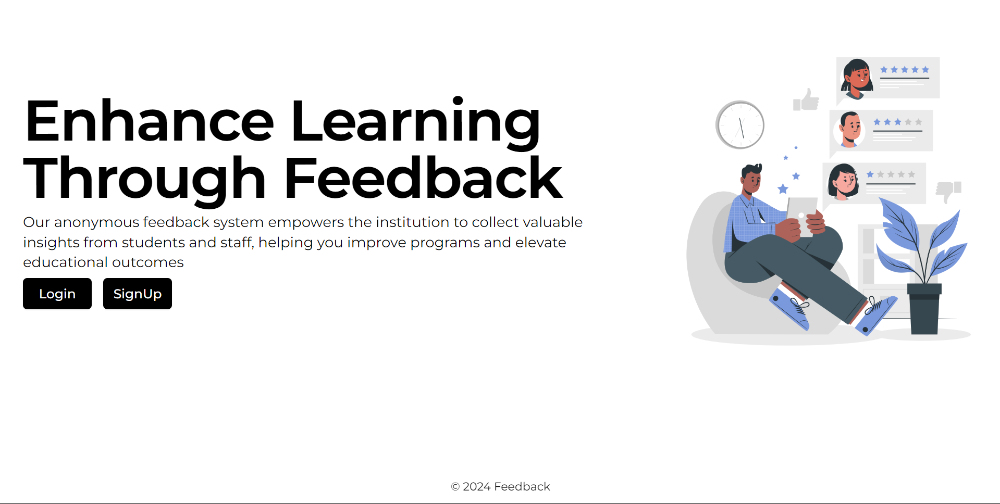

**Signup Page:** Page to sign up new user for the application.
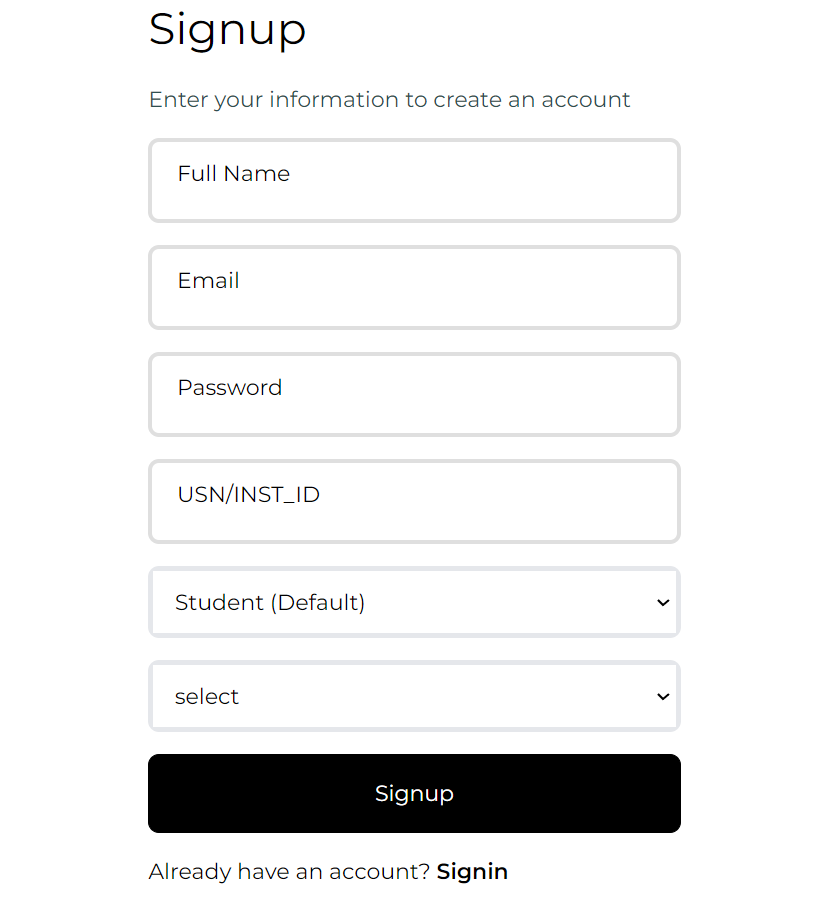

**Signin Page:** Page to sign in existing user for the application.
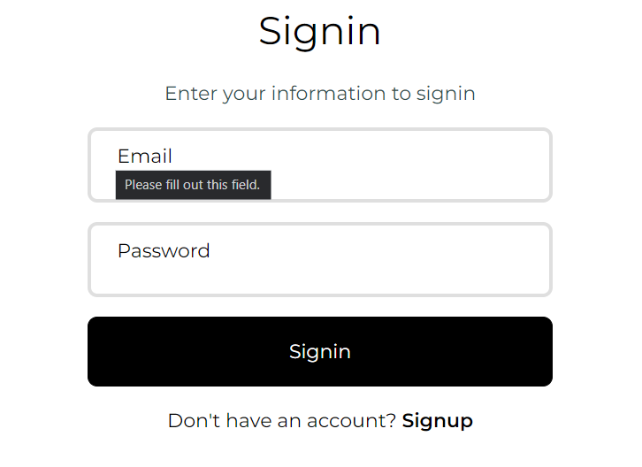

## Instructor Interface

**Form creation page:** Page to create new form for feedback.
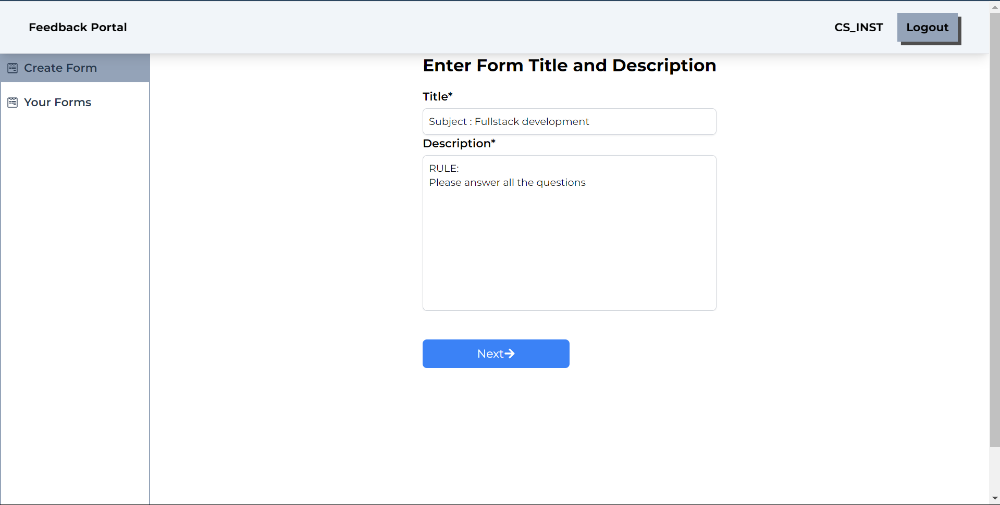

**Add questions page:** Page to add questions to the form.
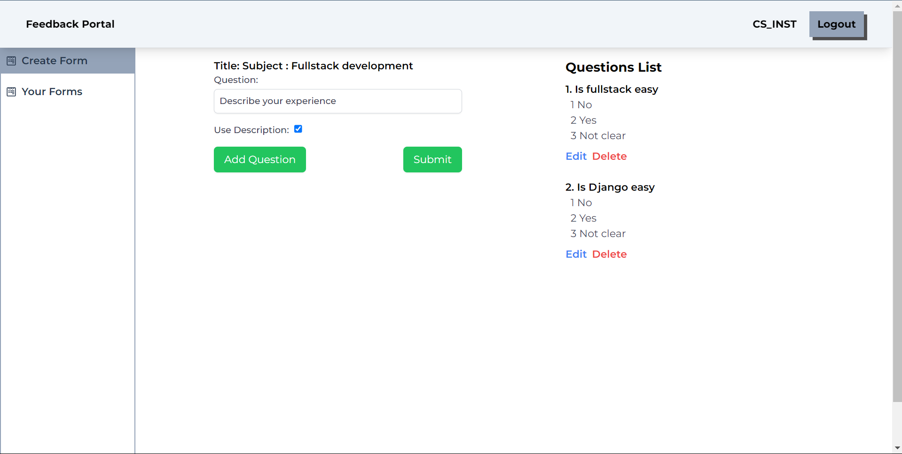

**View Forms page:** Page to view all forms created by the instructor of specific department.
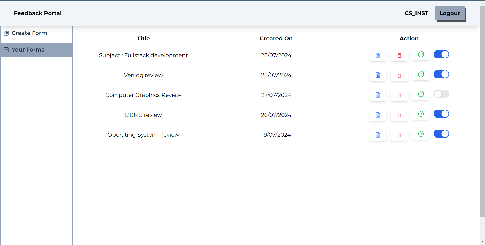

**Form Analytics page:** Page to view analytics of specific form.
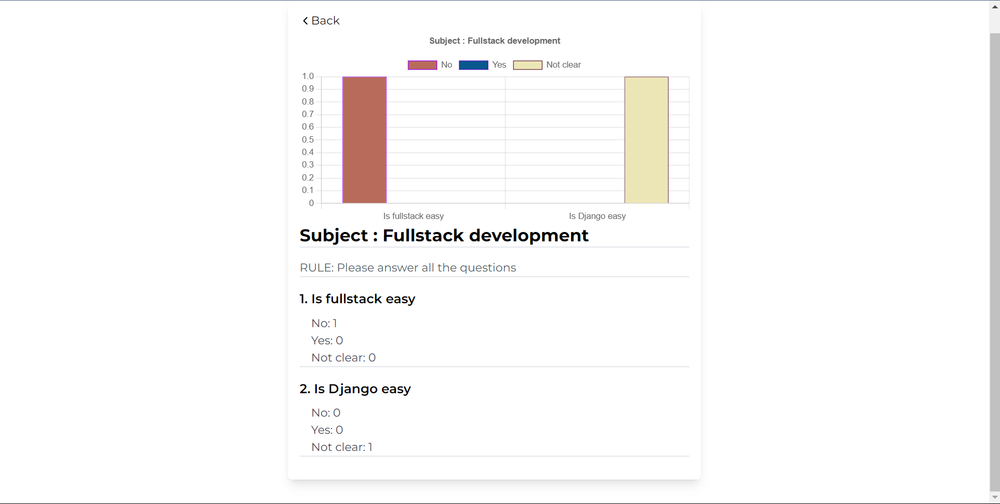

## Student Interface

**Add Image Feedback**: Page to add image feedback.
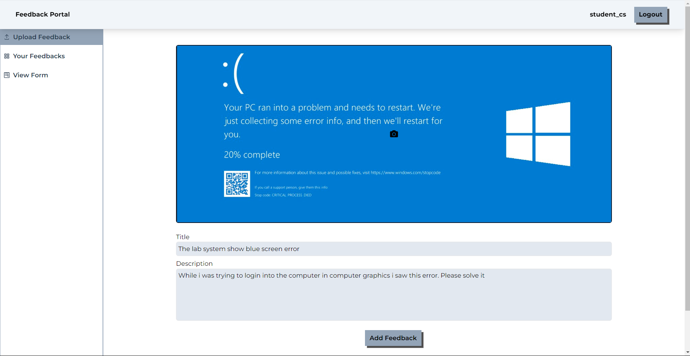

**View All image feedback**: Page to view, edit, delete all image feedback submitted by students .
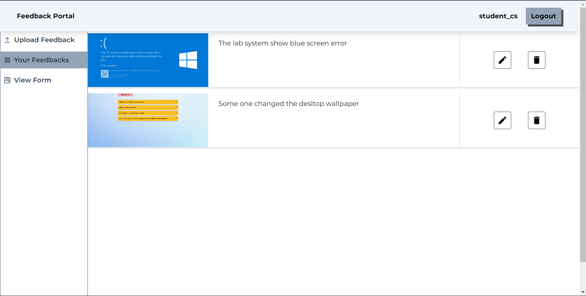

**Forms Table page:** Page to view all forms of specific department.
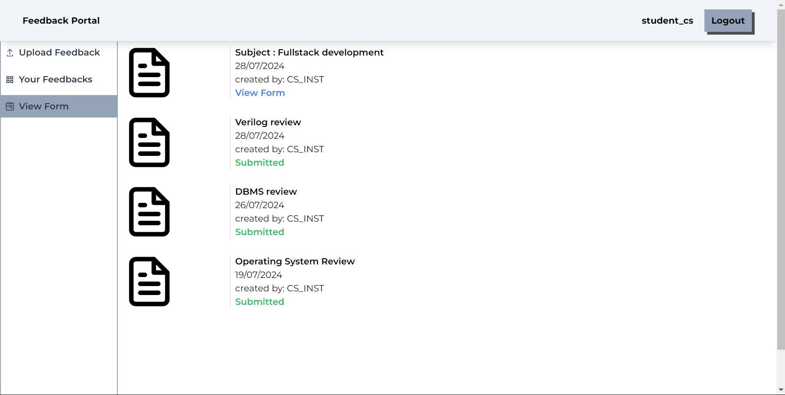

**Fill Feedback Form page:** Page to fill feedback form.
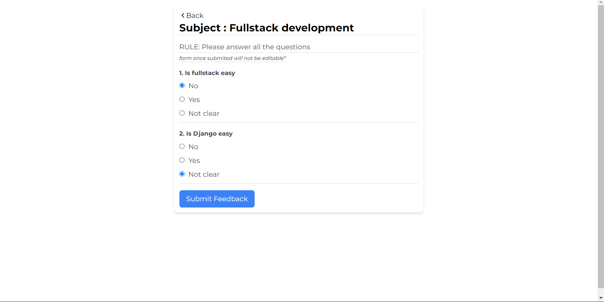

## Admin Interface

**View Imagefeedback page:** Page to view all forms and image feedback across departments.
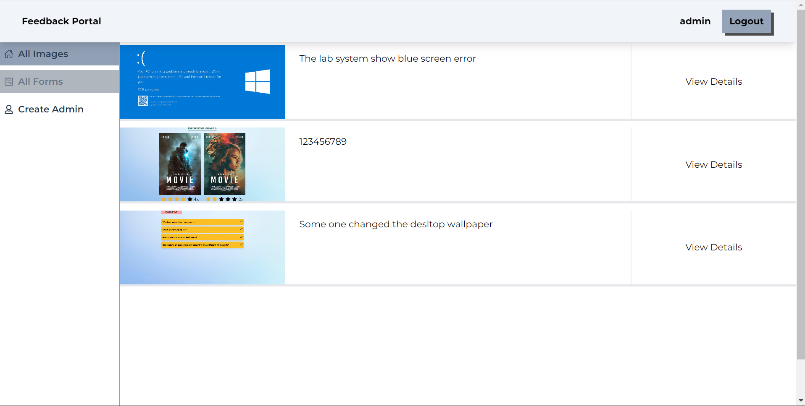

**All Forms page:** Page to view all forms created by the all the instructors of all department.

**Create Admins page:** Page to create new admin accounts.
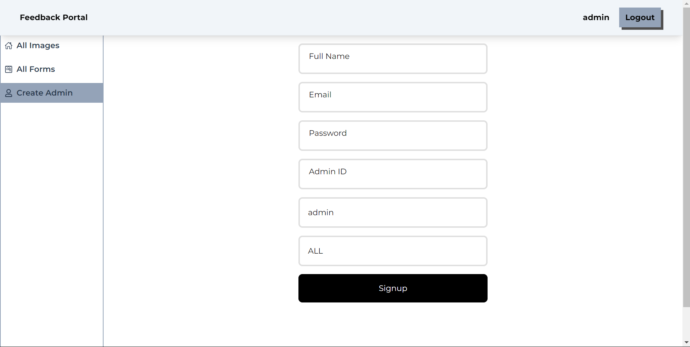
